# AI-Powered Product Search Algorithm Flowchart

## Overview Flow

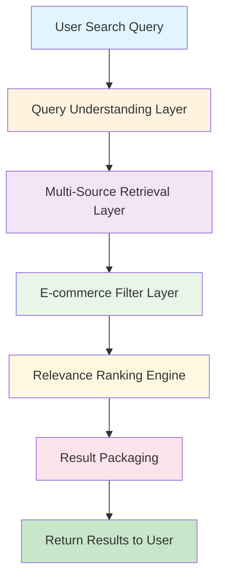

## Detailed Algorithm Flow

```mermaid
flowchart TD
    Start([User enters search query]) --> InputValidation{Query valid?}
    InputValidation -->|No| ClearCache[Clear previous results]
    InputValidation -->|Yes| QueryPreprocess[Query Understanding Layer]
    
    ClearCache --> ReturnEmpty[Return empty results]
    
    QueryPreprocess --> ProcessQuery[Process & enhance query]
    ProcessQuery --> CheckCache{Cache hit?}
    
    CheckCache -->|Yes| ReturnCached[Return cached results]
    CheckCache -->|No| StartRetrieval[Start Multi-Source Retrieval]
    
    StartRetrieval --> API1[Google Shopping API]
    API1 --> API1Success{Success?}
    API1Success -->|Yes| CollectResults1[Collect results]
    API1Success -->|No| API2[Google Custom Search - Shopping]
    
    CollectResults1 --> CheckMinResults1{Enough results?}
    CheckMinResults1 -->|Yes| ProceedToFilter[Proceed to filtering]
    CheckMinResults1 -->|No| API2
    
    API2 --> API2Success{Success?}
    API2Success -->|Yes| CollectResults2[Collect results]
    API2Success -->|No| API3[Google Custom Search - General]
    
    CollectResults2 --> CheckMinResults2{Enough results?}
    CheckMinResults2 -->|Yes| ProceedToFilter
    CheckMinResults2 -->|No| API3
    
    API3 --> API3Success{Success?}
    API3Success -->|Yes| CollectResults3[Collect results]
    API3Success -->|No| API4[Google Custom Search - Indian]
    
    CollectResults3 --> CheckMinResults3{Enough results?}
    CheckMinResults3 -->|Yes| ProceedToFilter
    CheckMinResults3 -->|No| API4
    
    API4 --> API4Success{Success?}
    API4Success -->|Yes| CollectResults4[Collect results]
    API4Success -->|No| WebScrape[Web Scraping Fallback]
    
    CollectResults4 --> CheckMinResults4{Enough results?}
    CheckMinResults4 -->|Yes| ProceedToFilter
    CheckMinResults4 -->|No| WebScrape
    
    WebScrape --> CollectResults5[Collect results]
    CollectResults5 --> ProceedToFilter
    
    ProceedToFilter --> EcommerceFilter[E-commerce Filter Layer]
    EcommerceFilter --> DomainFilter[Domain whitelisting]
    DomainFilter --> ContentFilter[Content analysis]
    ContentFilter --> StructuredData[Structured data check]
    StructuredData --> Deduplication[GTIN deduplication]
    Deduplication --> Ranking[Relevance Ranking Engine]
    
    Ranking --> LexicalScore[Calculate Lexical Score]
    LexicalScore --> SemanticScore[Calculate Semantic Score]
    SemanticScore --> BusinessScore[Calculate Business Score]
    BusinessScore --> BehavioralScore[Calculate Behavioral Score]
    BehavioralScore --> TotalScore[Calculate Total Score]
    TotalScore --> SortResults[Sort by relevance]
    
    SortResults --> PackageResults[Result Packaging]
    PackageResults --> CacheResults[Cache results]
    CacheResults --> ReturnResults[Return results to user]
    
    ReturnCached --> End([End])
    ReturnEmpty --> End
    ReturnResults --> End
    
    style Start fill:#e3f2fd
    style End fill:#e8f5e8
    style InputValidation fill:#fff3e0
    style QueryPreprocess fill:#f3e5f5
    style EcommerceFilter fill:#e8f5e8
    style Ranking fill:#fff8e1
    style PackageResults fill:#fce4ec
```

## Query Understanding Layer Flow

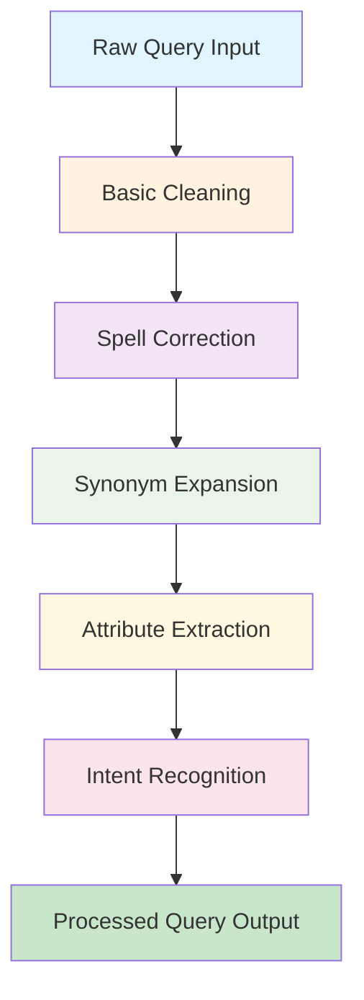

## Multi-Source Retrieval Flow

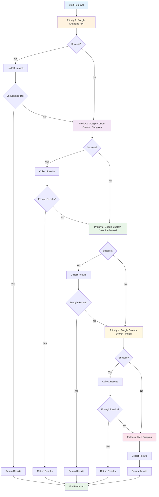

## E-commerce Filter Layer Flow

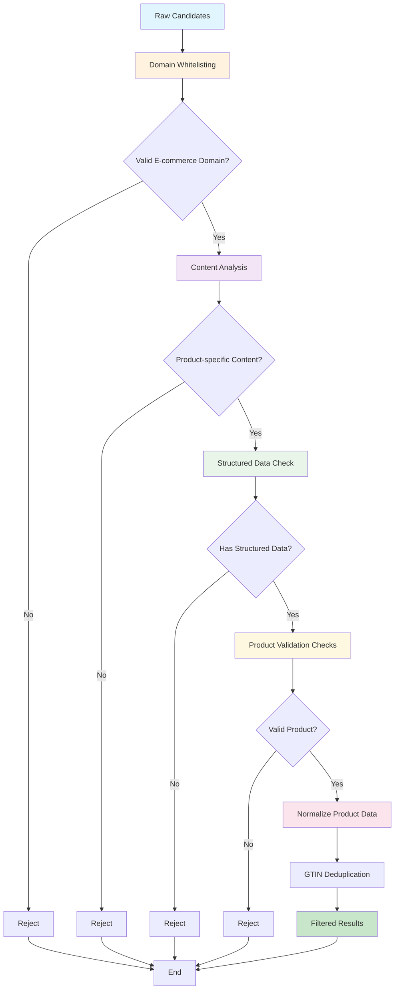

## Relevance Ranking Engine Flow

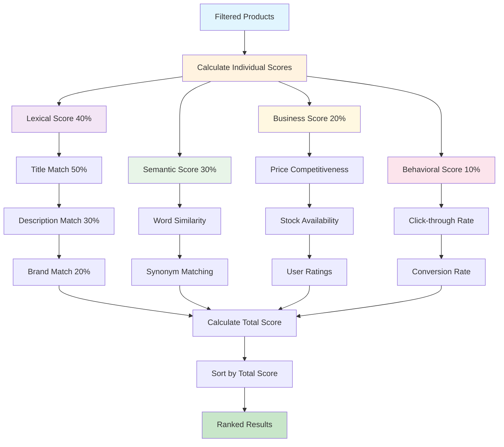

## Error Handling Flow

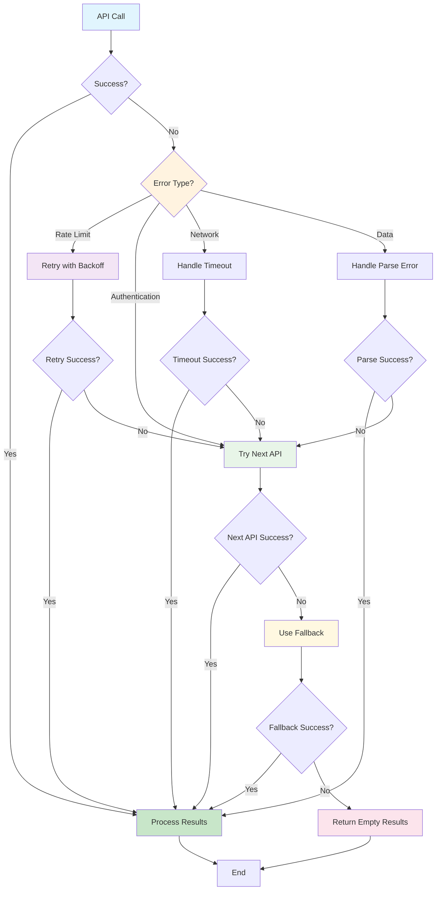

## Caching Strategy Flow

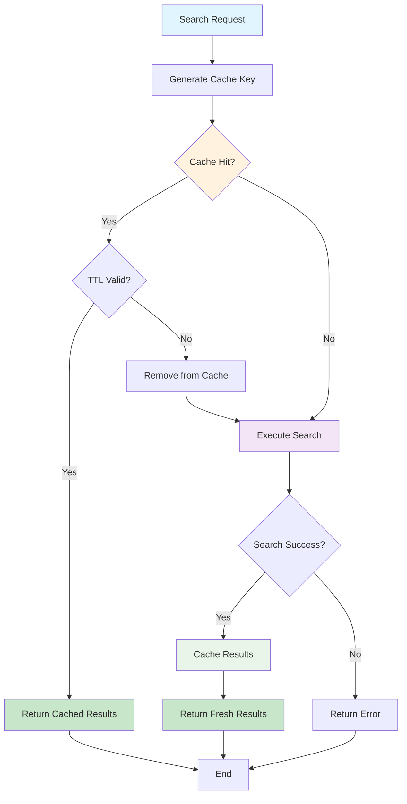

## Performance Optimization Flow

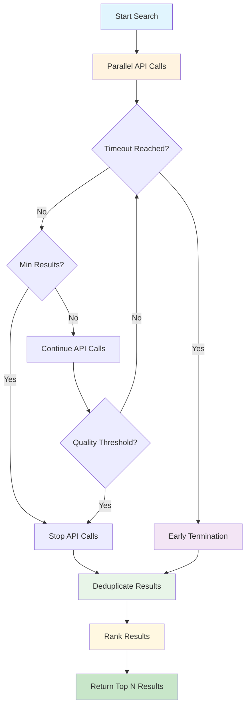

## Data Flow Architecture

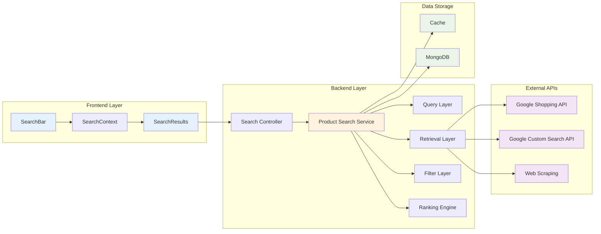

## Key Performance Indicators (KPIs)

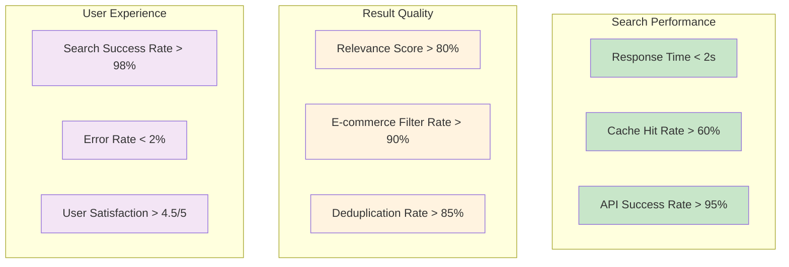

This flowchart documentation provides a comprehensive visual representation of our AI-powered product search algorithm, showing the step-by-step flow, decision points, error handling, and performance optimizations. Each diagram can be used for:

1. **Development Reference**: Understanding the algorithm flow
2. **Code Review**: Ensuring implementation matches design
3. **Debugging**: Identifying where issues occur
4. **Performance Analysis**: Understanding bottlenecks
5. **Team Communication**: Explaining the system to stakeholders 